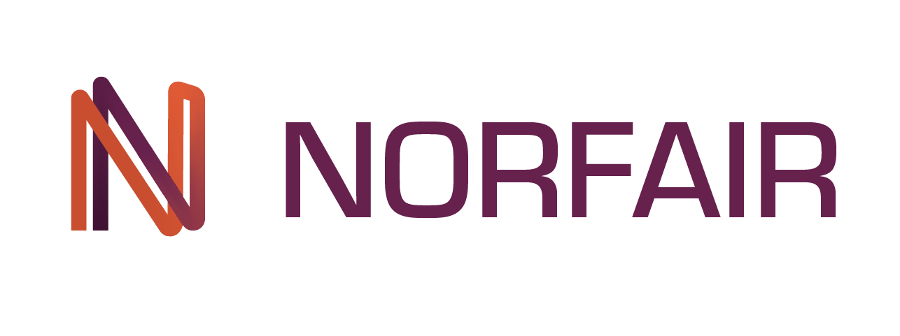

 [](https://colab.research.google.com/github/tryolabs/norfair/blob/master/demos/yolov4/yolov4_demo.ipynb)  [](https://zenodo.org/badge/latestdoi/276473370)

Norfair is a customizable lightweight Python library for real-time 2D object tracking.

Using Norfair, you can add tracking capabilities to any detector with just a few lines of code.

## Features

- Any detector expressing its detections as a series of `(x, y)` coordinates can be used with Norfair. This includes detectors performing object detection, pose estimation, and interest point detection.

- The function used to calculate the distance between tracked objects and detections is defined by the user, making the tracker extremely customizable. This function can make use of any extra information, such as appearance embeddings, which can heavily improve tracking performance.

- Modular. It can easily be inserted into complex video processing pipelines to add tracking to existing projects. At the same time it is possible to build a video inference loop from scratch using just Norfair and a detector.

- Fast. The only thing bounding inference speed will be the detection network feeding detections to Norfair.

Norfair is built, used and maintained by [Tryolabs](https://tryolabs.com).

## Installation

Norfair currently supports Python 3.7+.

For the minimal version, install as:

```bash
pip install norfair
```

To make Norfair install the dependencies to support more features, install as:

```bash
pip install norfair[video]  # Adds several video helper features running on OpenCV
pip install norfair[metrics]  # Supports running MOT metrics evaluation
pip install norfair[metrics,video]  # Everything included
```

If the needed dependencies are already present in the system, installing the minimal version of Norfair is enough for enabling the extra features. This is particuarly useful for embedded devices, where installing compiled dependencies can be difficult, but they can sometimes come preinstalled with the system.

## How it works

Norfair works by estimating the future position of each point based on its past positions. It then tries to match these estimated positions with newly detected points provided by the detector. For this matching to occur, Norfair can rely on any distance function specified by the user of the library. Therefore, each object tracker can be made as simple or as complex as needed.

The following is an example of a particularly simple distance function calculating the Euclidean distance between tracked objects and detections. This is possibly the simplest distance function you could use in Norfair, as it uses just one single point per detection/object.

```python
 def euclidean_distance(detection, tracked_object):
     return np.linalg.norm(detection.points - tracked_object.estimate)
```

As an example we use [Detectron2](https://github.com/facebookresearch/detectron2) to get the single point detections to use with this distance function. We just use the centroids of the bounding boxes it produces around cars as our detections, and get the following results.


On the left you can see the points we get from Detectron2, and on the right how Norfair tracks them assigning a unique identifier through time. Even a straightforward distance function like this one can work when the tracking needed is simple.

Norfair also provides several useful tools for creating a video inference loop. Here is what the full code for creating the previous example looks like, including the code needed to set up Detectron2:

```python
import cv2
import numpy as np
from detectron2.config import get_cfg
from detectron2.engine import DefaultPredictor

from norfair import Detection, Tracker, Video, draw_tracked_objects

# Set up Detectron2 object detector
cfg = get_cfg()
cfg.merge_from_file("demos/faster_rcnn_R_50_FPN_3x.yaml")
cfg.MODEL.ROI_HEADS.SCORE_THRESH_TEST = 0.5
cfg.MODEL.WEIGHTS = "detectron2://COCO-InstanceSegmentation/mask_rcnn_R_50_FPN_3x/137849600/model_final_f10217.pkl"
detector = DefaultPredictor(cfg)

# Norfair
video = Video(input_path="video.mp4")
tracker = Tracker(distance_function=euclidean_distance, distance_threshold=20)

for frame in video:
    detections = detector(cv2.cvtColor(frame, cv2.COLOR_BGR2RGB))
    detections = [Detection(p) for p in detections['instances'].pred_boxes.get_centers().cpu().numpy()]
    tracked_objects = tracker.update(detections=detections)
    draw_tracked_objects(frame, tracked_objects)
    video.write(frame)
```

The video and drawing tools use OpenCV frames, so they are compatible with most Python video code available online. The point tracking is based on [SORT](https://arxiv.org/pdf/1602.00763.pdf) generalized to detections consisting of a dynamically changing amount of points per detection.

## Motivation

Trying out the latest state of the art detectors normally requires running repositories which weren't intended to be easy to use. These tend to be repositories associated with a research paper describing a novel new way of doing detection, and they are therefore intended to be run as a one-off evaluation script to get some result metric to publish on a particular research paper. This explains why they tend to not be easy to run as inference scripts, or why extracting the core model to use in another standalone script isn't always trivial.

Norfair was born out of the need to quickly add a simple layer of tracking over a wide range of newly released SOTA detectors. It was designed to seamlessly be plugged into a complex, highly coupled code base, with minimum effort. Norfair provides a series of modular but compatible tools, which you can pick and chose to use in your project.

## Documentation

:blue_book: You can find the documentation for Norfair's API [here](docs/README.md).

## Examples

We provide several examples of how Norfair can be used to add tracking capabilities to several different detectors.

1. [Simple tracking of cars](demos/detectron2) using [Detectron2](https://github.com/facebookresearch/detectron2).
2. [Faster tracking of cars/pedestrians and other 78 classes](demos/yolov5) using [YOLOv5](https://github.com/fcakyon/yolov5-pip). Try it on any YouTube video on this [Google Colab notebook](https://colab.research.google.com/github/tryolabs/norfair/blob/master/demos/yolov5/yolov5_demo.ipynb).
3. [Faster tracking of cars](demos/yolov4) using [YOLOv4](https://github.com/Tianxiaomo/pytorch-YOLOv4/tree/master).
4. Inserting Norfair into an existing project: [Simple tracking of pedestrians](demos/alphapose) using [AlphaPose](https://github.com/MVIG-SJTU/AlphaPose).
5. [Speed up pose estimation by extrapolating detections](demos/openpose) using [OpenPose](https://github.com/CMU-Perceptual-Computing-Lab/openpose).


## Comparison to other trackers

Norfair's contribution to Python's object tracker library repertoire is its ability to work with any object detector by being able to work with a variable number of points per detection, and the ability for the user to heavily customize the tracker by creating their own distance function.

If you are looking for a tracker, here are some other projects worth noting:

- [**OpenCV**](https://opencv.org) includes several tracking solutions like [KCF Tracker](https://docs.opencv.org/3.4/d2/dff/classcv_1_1TrackerKCF.html) and [MedianFlow Tracker](https://docs.opencv.org/3.4/d7/d86/classcv_1_1TrackerMedianFlow.html) which are run by making the user select a part of the frame to track, and then letting the tracker follow that area. They tend not to be run on top of a detector and are not very robust.
- [**dlib**](http://dlib.net) includes a correlation single object tracker. You have to create your own multiple object tracker on top of it yourself if you want to track multiple objects with it.
- [**AlphaPose**](https://github.com/MVIG-SJTU/AlphaPose) just released a new version of their human pose tracker. This tracker is tightly integrated into their code base, and to the task of tracking human poses.
- [**SORT**](https://github.com/abewley/sort) and [**Deep SORT**](https://github.com/nwojke/deep_sort) are similar to this repo in that they use Kalman filters (and a deep embedding for Deep SORT), but they are hardcoded to a fixed distance function and to tracking boxes. Norfair also adds some filtering when matching tracked objects with detections, and changes the Hungarian Algorithm for its own distance minimizer. Both these repos are also released under the GPL license, which might be an issue for some individuals or companies because the source code of derivative works needs to be published.

## Benchmarks

[MOT17](https://motchallenge.net/data/MOT17/) results obtained using [motmetrics4norfair](https://github.com/tryolabs/norfair/tree/master/demos/motmetrics4norfair) demo script. Hyperparameters were tuned for reaching a high `MOTA` on this dataset. A more balanced set of hyperparameters, like the default ones used in the other demos, is recommended for production.

|                | Rcll  | Prcn  | GT    MT   PT   ML  | FP     FN      IDs   FM   | MOTA   MOTP  |
|:--------------:|:-----:|:-----:|:-------------------:|:-------------------------:|:------------:|
| MOT17-13-DPM   | 18.0% | 83.5% | 110   5    28   77  | 416    9543    120   125  | 13.4%  26.8% |
| MOT17-04-FRCNN | 56.3% | 93.2% | 83    18   43   22  | 1962   20778   90    104  | 52.0%  10.7% |
| MOT17-11-FRCNN | 61.5% | 93.1% | 75    19   33   23  | 431    3631    64    61   | 56.3%  10.1% |
| MOT17-04-SDP   | 77.6% | 97.4% | 83    48   26   9   | 1001   10672   225   254  | 75.0%  13.2% |
| MOT17-13-SDP   | 57.0% | 82.1% | 110   45   28   37  | 1444   5008    229   209  | 42.6%  20.1% |
| MOT17-05-DPM   | 38.0% | 82.2% | 133   10   58   65  | 570    4291    96    96   | 28.3%  24.2% |
| MOT17-09-DPM   | 59.9% | 75.4% | 26    4    18   4   | 1042   2137    119   113  | 38.1%  26.2% |
| MOT17-10-DPM   | 37.3% | 84.6% | 57    6    20   31  | 871    8051    127   154  | 29.5%  24.8% |
| MOT17-02-SDP   | 51.0% | 76.1% | 62    11   39   12  | 2979   9103    268   284  | 33.5%  18.2% |
| MOT17-11-DPM   | 54.2% | 84.5% | 75    12   24   39  | 935    4321    88    64   | 43.4%  21.7% |
| MOT17-09-FRCNN | 58.6% | 98.5% | 26    7    17   2   | 49     2207    40    39   | 56.9%   9.5% |
| MOT17-11-SDP   | 75.8% | 91.1% | 75    34   30   11  | 697    2285    103   101  | 67.3%  14.0% |
| MOT17-02-FRCNN | 36.6% | 79.7% | 62    7    26   29  | 1736   11783   119   131  | 26.6%  13.4% |
| MOT17-05-FRCNN | 54.7% | 89.2% | 133   24   68   41  | 457    3136    95    96   | 46.7%  18.1% |
| MOT17-04-DPM   | 42.5% | 83.6% | 83    7    44   32  | 3965   27336   401   420  | 33.3%  21.0% |
| MOT17-10-SDP   | 74.2% | 88.1% | 57    30   24   3   | 1292   3316    308   289  | 61.7%  19.8% |
| MOT17-10-FRCNN | 61.0% | 75.8% | 57    16   35   6   | 2504   5013    319   313  | 39.0%  17.3% |
| MOT17-09-SDP   | 67.6% | 94.6% | 26    12   14   0   | 204    1726    52    55   | 62.8%  13.0% |
| MOT17-02-DPM   | 20.2% | 81.6% | 62    5    14   43  | 843    14834   111   112  | 15.0%  24.6% |
| MOT17-13-FRCNN | 58.8% | 73.6% | 110   29   57   24  | 2455   4802    371   366  | 34.5%  18.5% |
| MOT17-05-SDP   | 66.7% | 87.6% | 133   32   81   20  | 653    2301    134   140  | 55.4%  16.5% |
| OVERALL        | 53.6% | 87.2% | 1638  381  727  530 | 26506  156274  3479  3526 | 44.7%  16.3% |


## Commercial support

Tryolabs can provide commercial support, implement new features in Norfair or build video analytics tools for solving your challenging problems. Norfair powers several video analytics applications, such as the [face mask detection](https://tryolabs.com/blog/2020/07/09/face-mask-detection-in-street-camera-video-streams-using-ai-behind-the-curtain/) tool.

If you are interested, please [contact us](https://tryolabs.com/#contact).

## Citing Norfair

For citations in academic publications, please export your desired citation format (BibTeX or other) from [Zenodo](https://doi.org/10.5281/zenodo.5146253).

## License

Copyright © 2022, [Tryolabs](https://tryolabs.com). Released under the [BSD 3-Clause](LICENSE).
